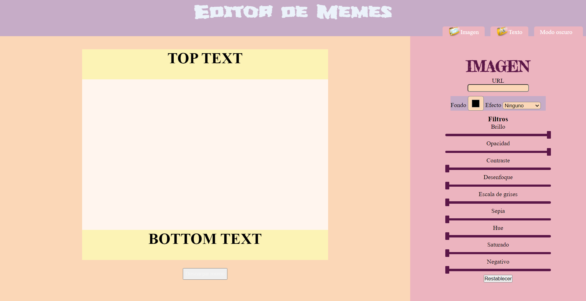

# Portafolio de Ada

### En este segundo proyecto, que corresponde al segundo módulo del curso desarrolladora FrontEnd, realicé un generador de memes. Se podrá acceder al mismo desde un navegador web.

 

***

### Si queres ver el resultado final podés darle click a este [enlace](https://github.com/Naty1401/editorMeme)

 

### Este proyecto no necesita la instalación de ninguna dependencia por ahora.

 

***

### Aqui te dejo una captura de la página finalizada, como deberias verla en el navegador desde una computadora

 

***

### En este proyecto busque aplicar todos los conocimientos adquiridos hasta este momento, espero que disfrtuen crando sus popios memes. Quiero agradecer a [Jonh Parra](https://github.com/Jonhks), a [Laydy](https://github.com/leydyk93), a mis compañeras de la 6ta generación Frontend online de Ada que me apoyaron y ayudaron siempre, y muy espacialmente a las atrasADAs, porque en esta montaña rusa de emociones, poder contar con esas personas que nos acompañan en el rocorrido, es una experiencia maravillosa y celebro sus logros como los mios propios.

 
 

#### Hecho por Naty